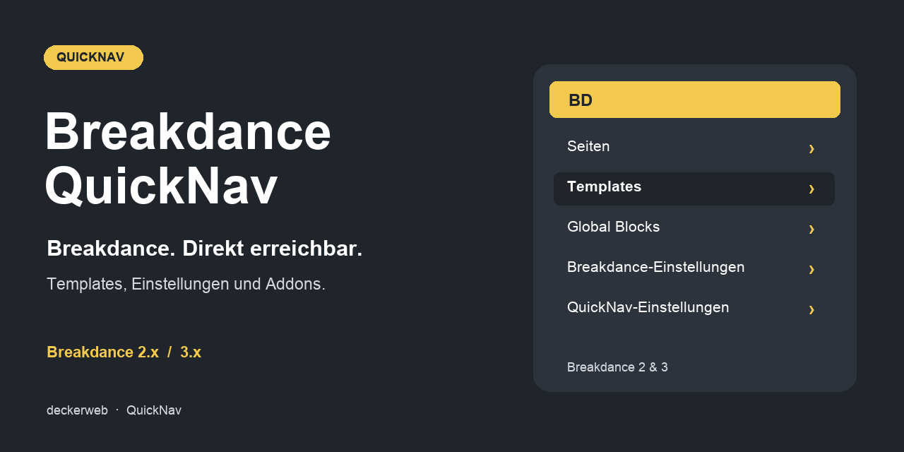

# Breakdance QuickNav

[English](README.md)

## Über das Plugin

Schneller Zugriff auf Breakdance-Seiten, Templates, Header, Footer, Global Blocks, Popups, Einstellungen und unterstützte Addons über die WordPress-Toolbar.

**Version:** 2.0.0-beta.3 (Testversion). **Voraussetzungen:** WordPress 6.7+, PHP 7.4+. Die Library benötigt PHP 8.0, der Updater PHP 8.1. Navigation und Einstellungen bleiben verfügbar, wenn eine gemeinsame Komponente nicht geladen werden kann. Unterstützt Breakdance 2.x und 3.x; geprüfte Quellpakete: 2.8.3 und 3.0.0 RC1. QuickNav benötigt keine Lizenz.

[FAQ](#faq) · [Änderungsverlauf](#änderungsverlauf) · [GitHub](https://github.com/deckerweb/breakdance-quicknav)

**Inhalt:** [Über das Plugin](#über-das-plugin) · [Auf einen Blick](#auf-einen-blick) · [Installation](#installation) · [Funktionen](#funktionen) · [FAQ](#faq) · [Änderungsverlauf](#änderungsverlauf) · [Projekt & Unterstützung](#projekt--unterstützung)

## Auf einen Blick

- Inhalte direkt erreichen; Standardmäßig bis zu 20 zuletzt geänderte Breakdance-Seiten und Einträge je Template-Gruppe. Öffentliche eigene Inhaltstypen, alphabetische Sortierung und bearbeitbare unveröffentlichte Inhalte lassen sich unter Breakdance → QuickNav (ohne aktiven Builder: Einstellungen → Breakdance QuickNav) auswählen.
- Website und persönliche Einstellungen; Toolbar-Bezeichnung, Icon, Menügruppen, Backend-/Frontend-Anzeige und berechtigte Benutzer einstellen. Profilvorlieben gelten nur für diese Website und können Website- oder Builder-Rechte nicht umgehen. Vier zugängliche Reiter teilen sich ein Formular mit fester Speicherleiste und Schutz vor dem Verlust ungespeicherter Änderungen.
- Breakdance-Einstellungen und Addons; Registrierte Einstellungsreiter, bestehende Addon-Integrationen und geprüfte Direktlinks für SiteCare, Jooosi Fon, Elements Hive, Express Add On und BreakColorUI Sync. Einzelne Integrationen und optionale Untermenüs lassen sich in den QuickNav-Einstellungen steuern. Addons ohne eigene Admin-Seite bleiben Diagnoseeinträge. Addons stehen in einem Sammelmenü, einzelne können samt Unterseiten direkt erscheinen. Elements Hive Pro ist geprüft; Destiny-/Dancepad-Adapter warten für vollständige Laufzeittests auf unveränderte Pakete.
- Ressourcen und bisherige Konfiguration; Alle bisherigen Links-/About-Ziele und sechs BDQN-Konstanten bleiben erhalten. Definierte Konstanten überschreiben gespeicherte Einstellungen. Ein ausdrücklich leeres BDQN_ENABLED_USERS-Array sperrt weiterhin alle Benutzer.
- Updates und weitere Plugins; deckerweb Updater 2.1.0 bietet Updates stabiler GitHub-Veröffentlichungen. Library 0.8.1 ergänzt die optionale Plugin-Entdeckung. Der Online-Katalog ist standardmäßig ausgeschaltet. Keine Telemetrie.
- Datenhaltung und native Editoren; QuickNav pausiert ohne passenden Breakdance-Builder; die Einstellungen bleiben erreichbar. Deaktivierung erhält Daten, Deinstallation folgt der Löschentscheidung jeder Website. WordPress steuert die Toolbar-Anzeige im Editor.

## Installation

1. Die bereitgestellte breakdance-quicknav-2.0.0-beta.3.zip unter Plugins → Installieren → Plugin hochladen installieren. Die Testversion zuerst auf einer Testwebsite verwenden.
2. QuickNav aktivieren und Breakdance → QuickNav (ohne aktiven Builder: Einstellungen → Breakdance QuickNav) öffnen. Ein unterstütztes Breakdance aktivieren, um die Toolbar-Navigation einzuschalten.
3. Persönliche Sichtbarkeit und Eintragszahl unter Benutzer → Profil einstellen. Bestehende BDQN-Konstanten behalten Vorrang.

## Funktionen

### Inhalte direkt erreichen

Standardmäßig bis zu 20 zuletzt geänderte Breakdance-Seiten und Einträge je Template-Gruppe. Öffentliche eigene Inhaltstypen, alphabetische Sortierung und bearbeitbare unveröffentlichte Inhalte lassen sich unter Breakdance → QuickNav (ohne aktiven Builder: Einstellungen → Breakdance QuickNav) auswählen.

### Website und persönliche Einstellungen

Toolbar-Bezeichnung, Icon, Menügruppen, Backend-/Frontend-Anzeige und berechtigte Benutzer einstellen. Profilvorlieben gelten nur für diese Website und können Website- oder Builder-Rechte nicht umgehen. Vier zugängliche Reiter teilen sich ein Formular mit fester Speicherleiste und Schutz vor dem Verlust ungespeicherter Änderungen.

### Breakdance-Einstellungen und Addons

Registrierte Einstellungsreiter, bestehende Addon-Integrationen und geprüfte Direktlinks für SiteCare, Jooosi Fon, Elements Hive, Express Add On und BreakColorUI Sync. Einzelne Integrationen und optionale Untermenüs lassen sich in den QuickNav-Einstellungen steuern. Addons ohne eigene Admin-Seite bleiben Diagnoseeinträge. Addons stehen in einem Sammelmenü, einzelne können samt Unterseiten direkt erscheinen. Elements Hive Pro ist geprüft; Destiny-/Dancepad-Adapter warten für vollständige Laufzeittests auf unveränderte Pakete.

### Ressourcen und bisherige Konfiguration

Alle bisherigen Links-/About-Ziele und sechs BDQN-Konstanten bleiben erhalten. Definierte Konstanten überschreiben gespeicherte Einstellungen. Ein ausdrücklich leeres BDQN_ENABLED_USERS-Array sperrt weiterhin alle Benutzer.

### Updates und weitere Plugins

deckerweb Updater 2.1.0 bietet Updates stabiler GitHub-Veröffentlichungen. Library 0.8.1 ergänzt die optionale Plugin-Entdeckung. Der Online-Katalog ist standardmäßig ausgeschaltet. Keine Telemetrie.

### Datenhaltung und native Editoren

QuickNav pausiert ohne passenden Breakdance-Builder; die Einstellungen bleiben erreichbar. Deaktivierung erhält Daten, Deinstallation folgt der Löschentscheidung jeder Website. WordPress steuert die Toolbar-Anzeige im Editor.

## FAQ

### Wo sind die Einstellungen?

Unter Breakdance → QuickNav (ohne aktiven Builder: Einstellungen → Breakdance QuickNav) oder über Einstellungen neben Deaktivieren in der Pluginliste. Persönliche Vorlieben stehen im Benutzerprofil.

### Warum fehlt QuickNav?

Breakdance 2.x oder 3.x muss im Breakdance-Modus aktiv sein. Die WordPress-Toolbar muss sichtbar sein; Website-/Benutzereinstellungen und Berechtigungen müssen die Anzeige erlauben. Ein aktiver Breakdance Navigator unterdrückt doppelte QuickNav-Navigation.

### Funktionieren bestehende Konstanten weiterhin?

Ja. BDQN_NAME_IN_ADMINBAR, BDQN_ICON, BDQN_NUMBER_TEMPLATES, BDQN_VIEW_CAPABILITY, BDQN_ENABLED_USERS und BDQN_DISABLE_FOOTER überschreiben gespeicherte Standardwerte. Eine leere bisherige Benutzerliste sperrt weiterhin alle Benutzer.

### Können Redakteure Entwürfe sehen?

Nur bei aktivierter Anzeige unveröffentlichter Inhalte sowie vorhandenen WordPress-Bearbeitungsrechten und Breakdance-Bearbeitungsrechten. Eine niedrigere Toolbar-Berechtigung gewährt keinen Builder-Zugriff.

### Welche Addons werden unterstützt?

Bestehende Integrationen bleiben erhalten. Die gelieferten Pakete sowie die frei verfügbaren SiteCare, Jooosi Fon, Elements Hive, Express Add On und BreakColorUI Sync sind für die Navigation geprüft. Weitere Premium-Pakete und WPML-Abhängigkeiten benötigen noch eigene Prüfungen. Siehe docs/ADDONS-de.md.

### Funktioniert das Plugin in Multisite?

Website- und Netzwerkaktivierung werden unterstützt. Website-Einstellungen und persönliche Vorlieben gelten je Website. Es entsteht keine websiteübergreifende Toolbar. Gemeinsame Library-Daten bleiben geschützt, solange ein anderer Host installiert ist.

### Was passiert bei der Deinstallation, und gibt es ein Snippet?

Einstellungen und Vorlieben bleiben standardmäßig erhalten. Die Löschoption entfernt nur die QuickNav-Daten dieser Website; bei Netzwerk-Deinstallation gilt die Entscheidung jeder Website. Breakdance-Inhalte bleiben erhalten. Ein separat erzeugtes Snippet ausschließlich für Navigation ist optional; nicht gleichzeitig mit dem Plugin aktivieren.

[Fragen nach Themen](docs/FAQ-de.md)

## Änderungsverlauf

### 2.0.0-beta.3 · 8. Oktober 2026 · Testversion

- **Verbessert:** Vier zugängliche Einstellungsbereiche, feste Speicherleiste und Hinweis auf ungespeicherte Änderungen mit gemeinsamem nativem Formular.
- **Verbessert:** Addon-Direktlinks in einem Menü sammeln; einzelne Addons samt Untermenüs optional direkt anzeigen. Installierte, fehlende und ausstehende Integrationen getrennt darstellen.
- **Neu:** Elements-Hive-Pro-Navigation mit Lizenz und Werkzeugen. Quellbasierte Adapter für Destiny Elements und Dancepad; ihre gelieferten Pakete sind nicht durch Laufzeittests bestätigt.

### 2.0.0-beta.2 · 8. Oktober 2026 · Testversion

- **Neu:** Website-Schalter für einzelne Addon-Integrationen, verständliche Verfügbarkeitshinweise und optionale Addon-Untermenüs.
- **Neu:** Navigation für SiteCare Builder Tools, Elements Hive, Express Add On und BreakColorUI Sync.
- **Behoben:** Jooosi Fon erkennen und seine aktuelle Admin-Adresse verwenden; Unterstützung für bisheriges Yabe Webfont erhalten.
- **Verbessert:** Bestehende Integrationen bleiben unterstützt. Addon-Links beachten Berechtigungen, geladene Module und Website-Vorlieben; ungeprüfte Pakete erzeugen keine geratenen Links.

### 2.0.0-beta.1 · 8. Oktober 2026 · Testversion

- **Neu:** Website-Einstellungen und persönliche Toolbar-Vorlieben.
- **Verbessert:** Navigation für Breakdance 2.x und 3.x mit registrierten Einstellungsreitern und berechtigten Zielen.
- **Behoben:** WooCommerce- und WPSix-Exporter-Verknüpfungen, Abfrage-/Einstellungsfilter und Builder-URLs.
- **Verbessert:** Bisherige Ressourcenlinks, Konfigurationskonstanten und Addon-Integrationen bleiben erhalten.
- **Neu:** deckerweb Updater 2.1.0 und Library 0.8.1 mit deutschen Du- und Sie-Übersetzungen.
- **Sonstiges:** WordPress steuert die Toolbar-Anzeige im Editor; QuickNav verändert das Editorlayout nicht mehr und entfernt das WordPress-Logo nicht.
- **Sonstiges:** Plugin-Einstellungen bleiben erhalten, sofern das Löschen nicht ausdrücklich aktiviert wurde. Das optionale Snippet bietet ausschließlich Navigation.
- **Neu:** Direktlinks je Formular unter Formular-Einsendungen für Formulare mit gespeicherten Einsendungen.
- **Verbessert:** QuickNav-Einstellungen stehen bei aktivem unterstütztem Builder unter Breakdance, sonst unter den WordPress-Einstellungen.
- **Behoben:** Speicherbestätigung genau einmal unter dem vollständigen Einstellungsheader anzeigen.
- **Verbessert:** Inhalts-Direktlinks sind nach veröffentlichten und unveröffentlichten Einträgen gruppiert; unveröffentlichte Inhalte zeigen ihren konkreten Status.
- **Verbessert:** Erkannte Komponenten zeigen Anzeige-Einstellungen verständlich als Aktiviert oder Deaktiviert statt technischer Zahlenwerte.

### 1.1.0 · 7. April 2025 · Repository-Stand

- **Neu:** Einstellbare Eintragszahl, Beschränkung auf Benutzer-IDs, Toolbar-Anzeige im Editor, Website-Zustandsinformationen und Unterstützung für Reading Time Calculator.
- **Verbessert:** Deutsche Übersetzungen, Git-Updater-Unterstützung und Verknüpfungen in der Pluginliste.

### 1.0.0 · 8. März 2025

- **Neu:** Erste Veröffentlichung mit Breakdance-Templates, Seiten, Ressourcen und Addon-Direktwegen einschließlich AI, Migration Mode, Yabe Webfont und WPSix Exporter.

## Projekt & Unterstützung

David Decker – DECKERWEB. QuickNav.

[Issues](https://github.com/deckerweb/breakdance-quicknav/issues) · [Security](SECURITY.md) · [Ko-fi](https://ko-fi.com/deckerweb) · [Buy Me a Coffee](https://buymeacoffee.com/daveshine) · [PayPal](https://paypal.me/deckerweb)

Das Plugin entstand als Fork von [Breakdance Navigator](https://github.com/beamkiller/breakdance-navigator), Peter Kulcsár, © 2024, GPL v2 or later.

Copyright © 2025–2026 David Decker – DECKERWEB. GPL v2 or later. Das bestehende Breakdance-Logo gehört Soflyy. Das neue Navigationssymbol ist eine eigene Vektorgrafik. deckerweb Updater 2.1.0 und Library 0.8.1: © 2026 David Decker – DECKERWEB, GPL-2.0-or-later.

Historische Grafiken enthalten Symbole von [Remix Icon](https://remixicon.com/), © Remix Icon. Die aktuellen Grafiken sind eigene Vektorgrafiken.

Einstellungsoberfläche und Host-Anbindung verwenden GPL-2.0-or-later-Code aus [Oxygen QuickNav 2.0.0](https://github.com/deckerweb/oxygen-quicknav/tree/v2.0.0), © 2025–2026 David Decker – DECKERWEB.
