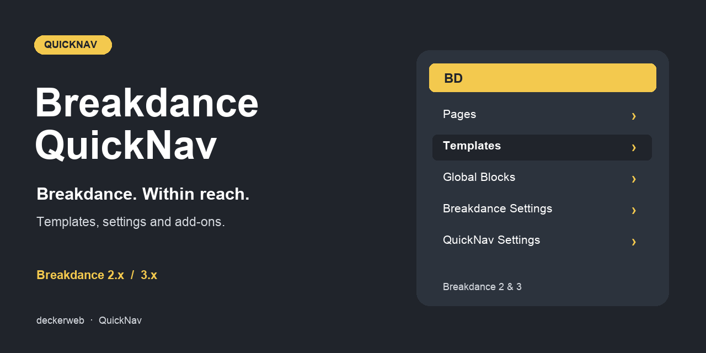

# Breakdance QuickNav

[Deutsch](README-de.md)

## About

Quick access to Breakdance pages, templates, headers, footers, global blocks, popups, settings and supported addons from the WordPress toolbar.

**Version:** 2.0.0-beta.1 (test version). **Requirements:** WordPress 6.7+, PHP 7.4+. Library requires PHP 8.0; the updater requires PHP 8.1. Navigation and settings remain available when a shared component cannot load. Supports Breakdance 2.x and 3.x; tested source packages: 2.8.3 and 3.0.0 RC1. A license is not required by QuickNav.

[FAQ](#faq) · [Changelog](#changelog) · [GitHub](https://github.com/deckerweb/breakdance-quicknav)

**Contents:** [About](#about) · [At a Glance](#at-a-glance) · [Installation](#installation) · [Features](#features) · [FAQ](#faq) · [Changelog](#changelog) · [Project & Support](#project--support)

## At a Glance

- Content shortcuts; By default, show up to 20 recently modified Breakdance pages and items in each template group. Select public custom post types, alphabetical sorting or editable unpublished items in Settings → Breakdance QuickNav.
- Website and personal settings; Set toolbar label, icon, visible menu groups, backend/frontend display and eligible users. Profile preferences apply to this website only and cannot bypass website or builder permissions.
- Breakdance settings and addons; Read registered settings tabs, including Agents & MCP in Breakdance 3. Retain AI, Migration Mode, Headspin Copilot, Yabe Webfont, WPSix Exporter and Reading Time Calculator support. WPSix Elements and Image Replacer appear in diagnostics without invented menu destinations.
- Resources and legacy configuration; Preserve every existing Links/About destination and all six BDQN constants. Defined constants override saved settings. An explicitly empty BDQN_ENABLED_USERS array denies all users.
- Updates and discovery; Bundled deckerweb Updater 2.1.0 offers stable GitHub release updates. Library 0.8.1 adds optional plugin discovery. Online catalog access is off by default. No telemetry.
- Safe lifecycle and native editors; QuickNav pauses when Breakdance is unavailable. Settings stay accessible. Deactivation retains data; uninstall follows each website’s deletion choice. WordPress controls editor toolbar visibility.

## Installation

1. Upload the provided breakdance-quicknav-2.0.0-beta.1.zip under Plugins → Add New → Upload Plugin. Install this test version on a test website first.
2. Activate QuickNav. Open Settings → Breakdance QuickNav; activate a supported Breakdance version to enable toolbar navigation.
3. Set personal visibility and item count under Users → Profile. Existing BDQN constants remain authoritative.

## Features

### Content shortcuts

By default, show up to 20 recently modified Breakdance pages and items in each template group. Select public custom post types, alphabetical sorting or editable unpublished items in Settings → Breakdance QuickNav.

### Website and personal settings

Set toolbar label, icon, visible menu groups, backend/frontend display and eligible users. Profile preferences apply to this website only and cannot bypass website or builder permissions.

### Breakdance settings and addons

Read registered settings tabs, including Agents & MCP in Breakdance 3. Retain AI, Migration Mode, Headspin Copilot, Yabe Webfont, WPSix Exporter and Reading Time Calculator support. WPSix Elements and Image Replacer appear in diagnostics without invented menu destinations.

### Resources and legacy configuration

Preserve every existing Links/About destination and all six BDQN constants. Defined constants override saved settings. An explicitly empty BDQN_ENABLED_USERS array denies all users.

### Updates and discovery

Bundled deckerweb Updater 2.1.0 offers stable GitHub release updates. Library 0.8.1 adds optional plugin discovery. Online catalog access is off by default. No telemetry.

### Safe lifecycle and native editors

QuickNav pauses when Breakdance is unavailable. Settings stay accessible. Deactivation retains data; uninstall follows each website’s deletion choice. WordPress controls editor toolbar visibility.

## FAQ

### Where are the settings?

Open Settings → Breakdance QuickNav or use Settings beside Deactivate in the plugin list. Personal preferences are in your profile.

### Why is QuickNav missing?

Check that Breakdance 2.x or 3.x is active in Breakdance mode, the WordPress toolbar is visible and your website/user visibility and permissions allow it. An active Breakdance Navigator suppresses duplicate QuickNav navigation.

### Will existing constants still work?

Yes. BDQN_NAME_IN_ADMINBAR, BDQN_ICON, BDQN_NUMBER_TEMPLATES, BDQN_VIEW_CAPABILITY, BDQN_ENABLED_USERS and BDQN_DISABLE_FOOTER override saved defaults. Empty legacy user allowlists still deny everyone.

### Can editors see drafts?

Only when unpublished content is enabled and the user has both WordPress object-edit rights and Breakdance edit permission. Setting a lower toolbar capability never grants builder access.

### Which addons are supported?

Existing integrations remain. The supplied AI and WPSix packages are checked; deeper verification of Headspin, Yabe, Reading Time Calculator and Migration Mode follows the first test version. See docs/ADDONS.md.

### Does it support Multisite?

Website and network activation are supported. Website settings and personal preferences remain site-scoped. No cross-site toolbar is created. Shared Library data is protected while another host remains installed.

### What happens on uninstall, and is a snippet available?

Settings and preferences are retained by default. The deletion option removes only this website’s QuickNav data; network uninstall applies each website’s choice. Breakdance content remains. A separately generated navigation-only snippet is optional; do not activate it beside the plugin.

[FAQ by topic](docs/FAQ.md)

## Changelog

### 2.0.0-beta.1 · October 8, 2026 · Test version

- **New:** Website settings and personal toolbar preferences.
- **Improved:** Navigation supports Breakdance 2.x and 3.x, with registered settings tabs and authorized destinations.
- **Fixed:** WooCommerce and WPSix Exporter links, query/settings filters and builder URLs.
- **Improved:** Existing resource links, configuration constants and addon integrations remain available.
- **New:** deckerweb Updater 2.1.0 and Library 0.8.1, with German informal and formal translations.
- **Misc:** WordPress controls editor toolbar visibility; QuickNav no longer changes the editor layout or removes the WordPress logo.
- **Misc:** Plugin settings are retained unless removal was explicitly enabled. The optional snippet has navigation only.

### 1.1.0 · April 7, 2025 · Repository version

- **New:** Configurable item count, user ID restrictions, editor toolbar visibility, Site Health information and Reading Time Calculator support.
- **Improved:** German translations, Git Updater support and plugin-list links.

### 1.0.0 · March 8, 2025

- **New:** Initial release with Breakdance templates, pages, resources and addon shortcuts, including AI, Migration Mode, Yabe Webfont and WPSix Exporter.

## Project & Support

David Decker – DECKERWEB. QuickNav.

[Issues](https://github.com/deckerweb/breakdance-quicknav/issues) · [Security](SECURITY.md) · [Ko-fi](https://ko-fi.com/deckerweb) · [Buy Me a Coffee](https://buymeacoffee.com/daveshine) · [PayPal](https://paypal.me/deckerweb)

This plugin originated as a fork of [Breakdance Navigator](https://github.com/beamkiller/breakdance-navigator), Peter Kulcsár, © 2024, GPL v2 or later.

Copyright © 2025–2026 David Decker – DECKERWEB. GPL v2 or later. The existing Breakdance logo belongs to Soflyy. The navigation symbol is original vector artwork. deckerweb Updater 2.1.0 and Library 0.8.1: © 2026 David Decker – DECKERWEB, GPL-2.0-or-later.

Retained legacy graphics contain [Remix Icon](https://remixicon.com/) symbols, © Remix Icon. The current artwork is original vector artwork.
